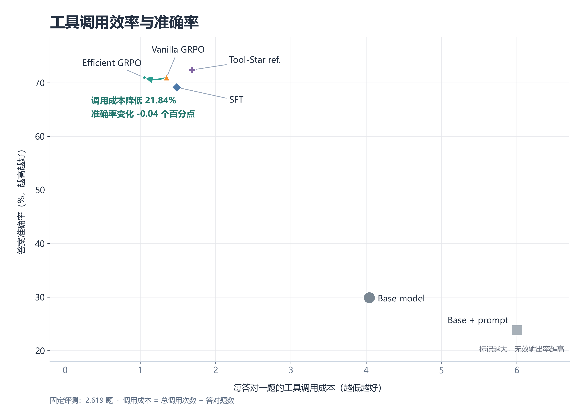

# ToolForge-RL

基于 Qwen2.5-3B 的工具推理训练实验，研究如何在保持答题能力的同时减少多余的工具调用。

在 **2,619 道固定评测题**上，高效 GRPO 将平均工具调用次数降低 **21.88%**，准确率由 **70.98%** 变为 **70.94%**。

## 主要结果



图中越靠左上越好。横轴为总调用次数除以答对题数；高效 GRPO 在这一指标上降低 **21.84%**。

两组模型从同一个监督微调（SFT）模型出发，使用相同训练设置，仅调整奖励中的效率项。评测覆盖数学、检索和“检索后计算”等任务。

平均调用降幅的 95% 置信区间为 **[19.91%, 23.93%]**；准确率差异为 **−0.04 个百分点**，95% 置信区间为 **[−1.22, +1.18]**。结果支持本实验范围内的调用效率提升。

## 方法

### 数据来源与划分

**2,500 道原始问题**由 2,000 道公开训练集问题和 500 道程序合成题组成，按四类任务组织：

| 任务类型 | 数量 | 来源与用途 |
|---|---:|---|
| 直接作答观察（direct_anchor） | 500 | 从 **GSM8K 训练集**抽样，用于观察模型直接回答与调用工具的倾向。 |
| 数学推理（code_reasoning） | 750 | **GSM8K 375 道 + MATH 375 道**，均来自训练集，覆盖算术与较复杂的数学问题。 |
| 检索推理（retrieval_reasoning） | 750 | 从 **HotpotQA 与 2WikiMultihopQA 训练集**抽样，将每题附带的 context 转为本地可检索文档。 |
| 检索后计算（retrieve_then_compute） | 500 | 程序生成实体、数值和干扰文档，题目要求检索数值后完成求和、差值、乘积或加权计算。 |

任务类型用于数据组织和分组评估，模型仍自主决定是否调用工具。检索仅访问当前题目附带的文档，不访问互联网。

生成轨迹前先去重，再按原题 `source_id` 划分为 **SFT 1,100 道、RL 候选 800 道、Dev 200 道、Internal Test 400 道**，同题的派生轨迹保留在同一分区。最终评测由 Internal Test 400 道与另行冻结的公开 held-out 2,219 道组成。

具体来源版本见[资源清单](data/manifests/source_manifest.json)，数量与分区见[原题清单](data/manifests/raw_prompt_manifest.json)，构建逻辑见[数据脚本](scripts/build_raw_prompts.py)。

### 训练流程

1. **生成与筛选轨迹**：使用 Tool-Star 教师模型，对 1,100 道 SFT 原题分别施加无额外提示、工具提示和效率提示，生成 **3,300 条候选轨迹**。真实执行 Python 与本地检索，结合答案、协议和执行状态筛选，优先保留调用较少的正确路径，得到 **1,076 条项目轨迹**；再加入 **1,000 条 Tool-Star 公开参考**，组成 2,076 条 SFT 样本。公开参考经过格式和长度筛选，未在本地逐条重执行。
2. **监督微调**：基于 **Qwen2.5-3B-Instruct** 进行 LoRA SFT，学习“生成工具指令 → 执行并回填结果 → 继续推理或输出答案”的多轮交互。两个 RL 分支使用同一个 SFT checkpoint 初始化。
3. **筛选 RL 问题**：冻结 SFT 模型，对独立的 800 道候选题各采样 4 次，保留正确性、调用次数或基础奖励存在差异的 **432 道问题**。正式训练时由当前策略重新在线采样，不直接复用选题阶段的轨迹。
4. **优化调用策略**：每题生成 4 条轨迹，以组内相对奖励更新策略，对比基础奖励的 **Vanilla GRPO** 与增加效率项的 **Efficient GRPO**；训练中屏蔽工具返回文本的策略损失，并用冻结 SFT 参考策略提供 KL 约束。

效率项以同题正确轨迹中的最少调用数 `C*` 为参照：

```text
R_efficient = R_base - 0.15 × I(answer_correct) × max(0, C - C*)
```

其中 `C` 为该轨迹的执行调用数，`I(answer_correct)` 在答案正确时为 1，否则为 0；组内没有正确轨迹时不计算效率惩罚。例如，两条正确路径分别调用 1 次和 2 次工具，后者额外扣 0.15；若组内只有一条三次调用的正确路径，则不因这三次调用受到效率惩罚。这样比较的是同题已观察到的正确路径，而非对所有工具调用一律扣分。

项目借鉴 [Tool-Star](https://github.com/RUC-NLPIR/Tool-Star) 的协议和公开资源，基于 Qwen2.5-3B 独立完成数据处理、工具执行、验证和训练流程。

## 查看示例与复现

- [真实交互示例](demo/example_trace.json)：查看模型生成的 Python 代码、工具返回和最终答案，无需下载模型。
- [单题 Demo](demo/README.md)：准备本地模型及可选的训练后适配器，运行一次真实工具交互。
- [复现说明](REPRODUCIBILITY.md)：环境安装、基础测试、训练与评测入口，以及结果图的重新生成方法。
- [实验报告](reports/README.md)：完整结果、统计分析和数据说明。
- [训练配置](configs/)与[运行脚本](scripts/)：各阶段实验入口。

本仓库包含代码、配置、结果摘要和图表；模型权重、完整数据及训练日志需按复现说明另行准备。结论限于当前 3B 模型和两类本地工具。

代码采用 [MIT 许可证](LICENSE)；第三方数据与模型的来源和许可见 [NOTICE](NOTICE)。
