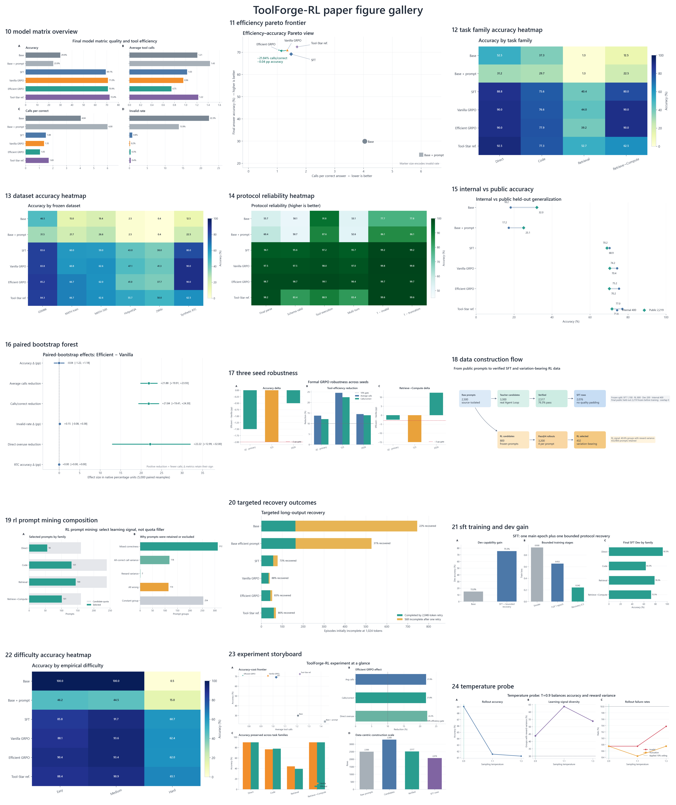
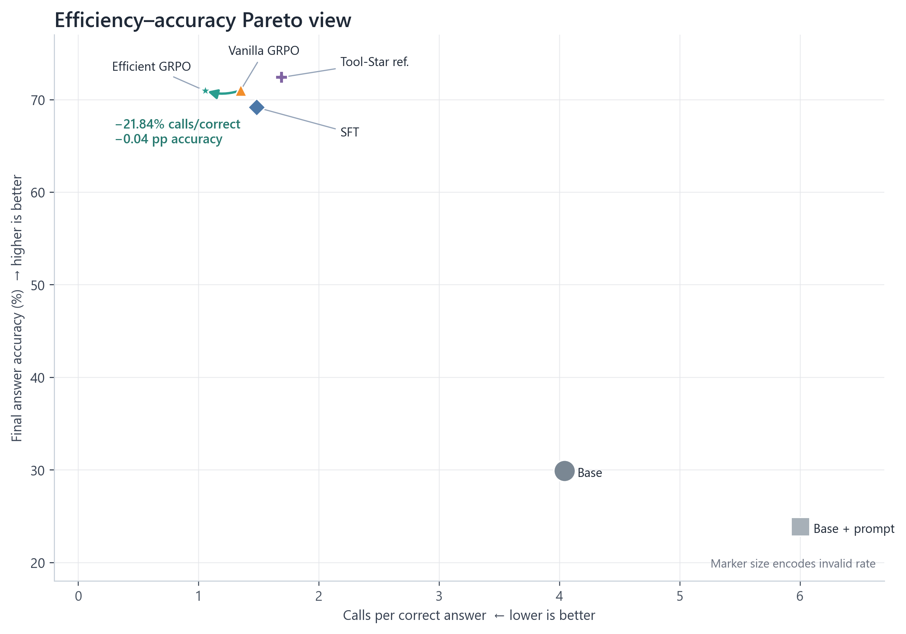

# ToolForge-RL

**Data-Centric Tool-Integrated Reasoning with Efficient GRPO**

ToolForge-RL is an end-to-end Qwen2.5-3B post-training experiment built from a clean server: public questions are converted into executable tool trajectories, verified with deterministic programs, used for LoRA SFT, mined with pass@4 for GRPO, and evaluated under a frozen Vanilla-versus-Efficient comparison.

Final status: **Gate 0–7 complete**. The preregistered success criteria **met** their joint threshold (`PASS`). All reported numbers below are read from frozen artifacts; negative checks are retained rather than repaired post hoc.



## What is different from Tool-Star?

Tool-Star supplies the protocol reference, a public teacher/reference checkpoint, and up to 1,000 screened SFT examples. This project is not a full Tool-Star reproduction: it fixes a smaller two-tool scope (`python_exec`, episode-local BM25 `local_search`) and independently implements real execution, observation reinjection, programmatic verification, quality filtering, difficulty labeling, pass@4 prompt mining, LoRA SFT, and paired Vanilla/Efficient GRPO. `dongguanting/Tool-Star-Qwen-3B` is reported only as a public reference model, never as a project-trained result.

Qwen2.5-3B-Instruct is intentionally fixed: it is small enough for repeatable 24 GB GPU experiments while still exposing meaningful correctness/efficiency trade-offs. The project does not switch to Qwen3/7B, DPO, online search, vLLM, or a larger tool catalog.

## Data pipeline

```text
public train-only prompts
  → source-ID split and normalized exact dedup
  → batched teacher Agent Loop
  → real Python/BM25 execution and observation reinjection
  → deterministic answer verifier
  → filtering and difficulty signals
  → SFT trajectories / trajectory-free RL prompts
```

- Raw source prompts: **2,500** (the user-revised frozen target), with zero source-ID overlap among SFT/RL/Dev/Internal.
- Teacher candidates: **3,300**; verified: **2,517** (76.27%).
- SFT examples: **2,076** high-quality rows, including **1,076** project-generated, real-tool-verified trajectories and **1,000** pinned public reference rows. The original 4,000 target was not padded with low-quality data.
- RL mining: **800** prompts × 4 rollouts; **432** prompts retained with policy/reward variation. The original 800 target was not padded (`non-zero reward variance=40.62%`).
- Structured agent-assisted semantic review: **100** rows, including 30 retrieve→compute; program/review agreement **100.00%**.
- Frozen final evaluation: **2,619** episodes = 400 Internal + 2,219 public held-out; SHA-256 `1ac3d2aaaad1f4a15727363cca766965ffca8b0a38468e87202505b103fc9995`.

SFT contains successful message/tool trajectories. GRPO data deliberately contains only prompts, tools/environment, references, verifiers, and metadata—never a gold trajectory for the policy.

## Tools and verification

- `python_exec`: a fresh restricted subprocess with no network, shell, subprocess spawning, or arbitrary file I/O; bounded CPU, RAM, time, and output.
- `local_search`: deterministic BM25 over documents attached to the current episode only; no global or online retrieval.
- GSM8K numeric normalization, math equivalence (`math-verify` plus bounded symbolic fallback), normalized QA/alias matching, and deterministic retrieve→compute ground truth.

Real tool execution matters because a syntactically plausible `<python>` or `<search>` block is not evidence that the operation ran, the observation was genuine, or the final answer was correct.

## Training and reward

The SFT adapter is trained from `Qwen/Qwen2.5-3B-Instruct`, not from the teacher. Vanilla and Efficient GRPO then fork from the same frozen SFT adapter with identical prompts, sample order, temperature, rollout budget, optimizer, LoRA configuration, and seeds.

```text
R_vanilla = answer_reward + format_reward - invalid_penalty
R_efficient = R_vanilla - 0.15 × I(correct) × max(0, calls - min_correct_calls_in_group)
```

The efficiency term is group-relative and correctness-gated. An incorrect zero-call rollout therefore receives no cost advantage; only redundant calls among correct rollouts are penalized. Prompts are mined instead of randomly sampled so that groups contain correctness or tool-call variation and can produce a learning signal.

## Frozen final results

| branch | accuracy | avg calls | calls/correct | direct unnecessary | RTC accuracy | invalid |
|---|---:|---:|---:|---:|---:|---:|
| Vanilla GRPO | 70.98% | 0.958 | 1.350 | 90.00% | 90.00% | 0.19% |
| Efficient GRPO | 70.94% | 0.748 | 1.055 | 70.00% | 90.00% | 0.34% |

Paired episode-level bootstrap (5,000 resamples):

- Accuracy delta: **-0.04 pp**, 95% CI [-1.22, +1.18].
- Average-call reduction: **21.88%**, 95% CI [19.91%, 23.93%].
- Calls-per-correct reduction: **21.84%**, 95% CI [19.41%, 24.30%].
- Direct unnecessary-call reduction: **22.22%**.
- Retrieve→compute accuracy delta: **+0.00 pp**; invalid-rate delta: **+0.15 pp**.



The exact threshold outcome and every individual check are preserved in `reports/paired_bootstrap.md`. Per-model, per-family, per-dataset, per-difficulty, and Internal/Public results are in `reports/final_results.md`.

## Reproduce

Use a recent CUDA-capable PyTorch environment; do not overwrite a working system CUDA/PyTorch installation. Portable direct-dependency pins are in `requirements.lock.txt`; the original CUDA/PyTorch environment is documented in `reports/environment_report.md`.

See [`REPRODUCIBILITY.md`](REPRODUCIBILITY.md) for lightweight unit tests, figure-only reproduction, and the full training/evaluation path, including which large or license-restricted artifacts are intentionally excluded from Git.

```bash
python -m venv .venv --system-site-packages
source .venv/bin/activate
python -m pip install -c constraints.txt -r requirements.txt
python -m pip install -e . --no-deps
make test
```

Download the pinned resources listed in `data/manifests/source_manifest.json`, then follow `PROGRESS.md`, `configs/`, and the stage entry points under `scripts/`. `scripts/run_remaining_pipeline.sh` is the resume-safe one-command Gate 6→7 orchestrator; `scripts/run_gate7_model.sh` preserves targeted long-output recovery. Model/data caches remain outside Git.

Once the frozen predictions and training logs are present, regenerate every final summary, bootstrap interval, figure, report, demo trace, and the full test result with one command:

```bash
make reproduce-final
```

Run the final adapter demo:

```bash
CUDA_VISIBLE_DEVICES=0 .venv/bin/python demo/toolforge_demo.py   "Compute the exact product 1,234,567 × 891."   --adapter runs/grpo_formal_efficient_seed42/final/adapter   --reference 1099999197 --verifier gsm8k
```

## Figures and reports

The nine preregistered plots are under `reports/figures/`, including accuracy/cost trade-offs, family accuracy, direct overuse, retrieve→compute completion, reward/KL/entropy proxy, reward variance, call distribution, and failure types. Key reports include:

An additional publication/PPT figure pack is available under `reports/figures_paper/`: 15 numbered analytical figures plus a gallery, each exported as a 260-dpi PNG and vector PDF. Regenerate the pack from frozen manifests only with `make reproduce-paper`.

- `reports/data_card.md`, `reports/data_quality_report.md`, `reports/data_lineage_report.md`
- `reports/final_results.md`, `reports/paired_bootstrap.md`, `reports/failure_analysis.md`
- `reports/resume_bullets.md` (Chinese and English)

## Limitations

- Only a 3B model and two deterministic local tools are studied; conclusions need not transfer to larger or online agents.
- The user-revised 2,500-prompt pool yielded fewer quality-passing SFT/RL rows than the original aspirational quotas; no low-quality padding was used.
- SFT protocol recovery was bounded to one additional half epoch and the original stricter parse/schema checks remain recorded.
- The teacher and Tool-Star reference can share ecosystem biases with the student even though final IDs are frozen and train/test exact-overlap checks are clean.
- Generated-token latency is hardware- and batching-dependent; tool-call counts and correctness are the primary efficiency measures.
- Long-generation handling uses a 1,024-token main pass and retries only genuinely incomplete episodes at 2,048 tokens; both raw and recovered predictions are retained.

## License and attribution

Project code is under the repository license. Dataset/model licenses and pinned revisions are listed in `NOTICE`, `reports/source_assets.md`, and `data/manifests/source_manifest.json`. Third-party raw datasets and model weights are not redistributed.
